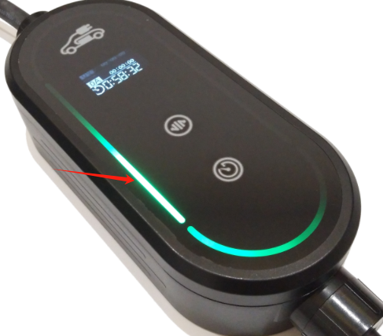
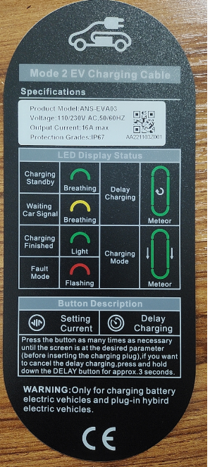
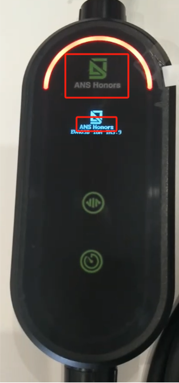
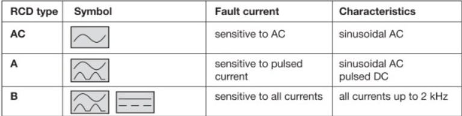
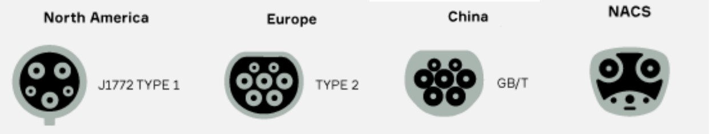
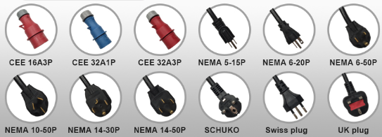

# Mode 2 Portable Ev Charger FAQ

## What Is Your Production Time?

We can send out sample with 5days if it is standard type. If you need mass quantity or customization, time is around 15-20days.

## Do You Do Customization?

Yes, we accept OEM service for customers, like OEM branding, cable length etc.

Below are how we usually OEM for our clients for the mode 2 portable ev charger(back label, front label, programmed branding, LED running light)

    
    
    

## What Is The IP Grade For Your Charger?

Our portable charger supports the highest waterproof, IP67. We have test report for it as well.

## Does This Charger Support Delay Charging?

Yes, you can set max 10 hours delay , and charge during night to save cost

## What Protections Does Your Charger Have?

Our portable charger supports over 7 protections: over voltage protection, under voltage protection, over load protection, short circuit protection, leakage protection, over-temp protection, lightning protection.

## What RCD Types Does Your Charger Use?

There are 3 types leakage current protection. Type AC, alternative current type leakage protection; Type A , in addition to AC leakage, Type A also protects against pulsating DC leakage. Type B, except above two types of current leakage protection, Type B(Type A+DC6mA) can also detect smooth DC leakage. Our charger use the Type B(Type A+DC6mA) module to protect, this is much safer.

## Is Your Charger Compatible With Tesla Model Y?  

Yes, we can produce the chargers with 4 different connectors which is now used on the market. T2(For standard), T1(For US standard), NACS(Recently adopted by many US brands), GB/T(Chinese standard). With these 4 charging standards, our chargers works on almost 98% electric vehicles.

## How Fast Does Your Charger Fully Charge An Electric Vehicle?

Charging time is always depending on the capacity of EV, Power of charger etc. For example, to charge a VW ID4 which has 52kWh battery capacity, our mode 2 portable ev charger 11kW will use around 6 hours to get it fully charged.

## Does You Charger Offer Travel Adapters To Use Under Different Socket?

Yes, we have the portable charger with interchangeable adapters. This adapter can recognize current automatically and avoid over-amp risk. Below are the common plug adapter we can produce for you. It covers countries like US, UK, Swiss, Germany etc.

## Hong Long Is Your Warranty?

We offer 2 years warranty. If any quality issue, we will offer replacement to you.

## What Is The MOQ?

We accept sample order for customer to test quality. Standard order over 10pcs

## What Is Your Payment Terms?

We accept 30% advance, 70% payment before shipment.

## What Certification Do You Have?

Exported to over 50 countries, We have different certifications for those markets too, like CE, TUV, UL, FCC etc.