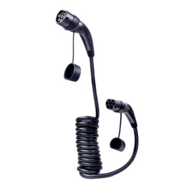
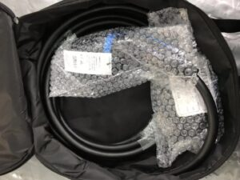

---
product:
    thumbnail: https://honorsev.com/wp-content/uploads/2024/04/%E6%9C%AA%E6%A0%87%E9%A2%98-2.jpg
    description: desc abc
---

# Type 2 To Type 2 EV Charging Cables Max 22kW 32A 3Phase 480V

## Description

 Introducing our type 2-2 cable, designed for convenient outdoor charging at AC public charging stations commonly found across Europe. Unlike many charging stations, European AC units typically come equipped with sockets but lack accompanying cables. With the type 2 cable, charging becomes effortless outdoors, allowing users to seamlessly connect their vehicles for charging purposes.

Crafted using TPU cable material, our cable boasts durability, cold resistance, and flexibility, ensuring it remains pliable even in harsh winter conditions. Moreover, its IP55 waterproof rating guarantees reliable outdoor performance regardless of weather conditions.

## Feature

* Meet 62196-2 standards
* Riveting connection inside without any screws outside
* TPU cable material improves abrasion resistance, cold resistance, still flexible in cold areas
* IP55 waterproof for safe outdoor charging
* Brand, logo, package.etc OEM customzation.
* TUV,CE,RACH,RoHs certificated
* Factory IATF 16949, ISO9001:2015, ISO14001:2015, OHSHS 18001:2007

## Packing

## FAQs For type 2-2 EV charging cables

### How long is the cables length ?
Normally 5M cable length is enough, we accept any length customization, like 3M, 7M, 10,15.etc, but we didn’t suggest the length extend to 20M more, it may affect the signal transit.

### Do these cables support customization?? 
Yes, sure, we support any ODM and OEM, including brand, logo package .etc.

### What measures do you take to prevent the signal line from being disconnected??
We have added an anti-breakage treatment and reserved the length of the signal cable to ensure that it is not easy to break during use due to pulling and tugging. Also we can assemle two signal wire directly.

### What type of cable are you using?
TPU halogen free cables that do not emit any toxic gases that are harmful to human health.

### What is the warranty policy for this cable?
We offer 24months warranty, during the warranty period, if the cable can’t be charged due to our problem, we will replace the new cable to you for free.